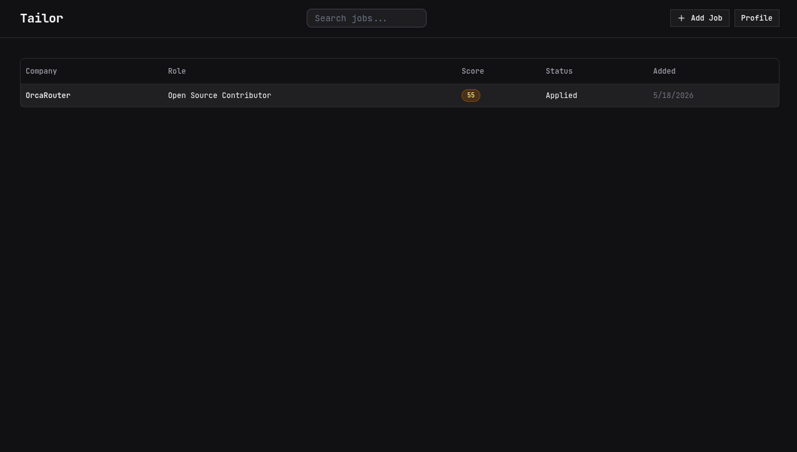
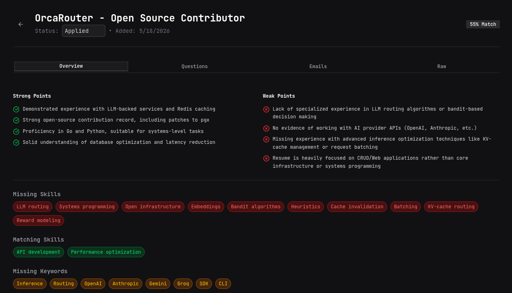
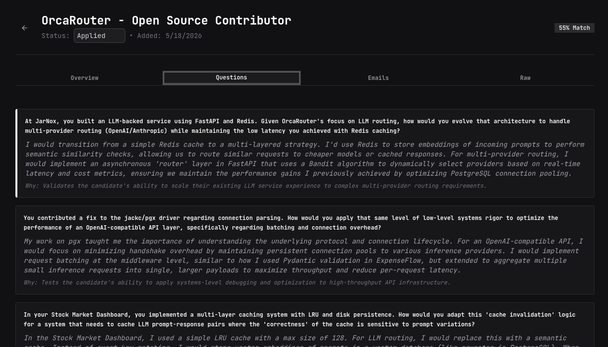
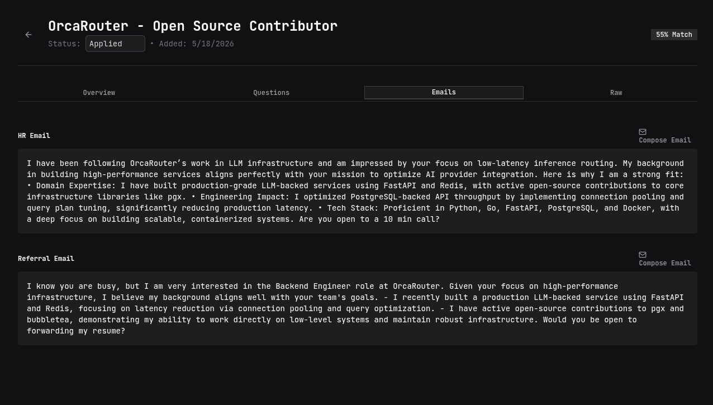

# Tailor — Self-hosted AI job hunting assistant

Tailor is a self-hosted, multi-agent AI assistant designed to streamline the job hunting process. It runs entirely on your machine via Docker, ensuring your sensitive data—like your resume and job preferences—never leaves your control, with the exception of necessary LLM inference calls to the Gemini API.

## Screenshots






## Features

- **Private & Self-hosted:** Your data stays local. No cloud storage, no subscriptions.
- **Async Processing:** Paste a job description (JD), and background agents analyze it without blocking your workflow.
- **Resume-Aware:** Upload your resume once and reuse it for every application.
- **Smart Analysis:**
  - **Match Score:** Get a 0-100 score based on your profile alignment.
  - **Gap Analysis:** Instantly see missing skills and keywords.
  - **Interview Prep:** Generate 5 tailored Q&As based on your specific projects and experience.
  - **Communication:** Auto-generate cold outreach and referral emails.
- **Status Tracking:** Keep track of your applications (In Progress, Applied, Rejected, Offered).
- **Keyboard-Driven UI:** Built for speed with vim-style navigation.

## Tech Stack

| Backend | Frontend | Infrastructure |
| :--- | :--- | :--- |
| Django, DRF | SvelteKit | Docker |
| LangGraph | shadcn-svelte | Docker Compose |
| Celery | Tailwind CSS | Nginx |
| PostgreSQL, Redis | | |
| pymupdf4llm | | |

## Multi-Agent Architecture

Tailor utilizes a multi-agent system orchestrated by a supervisor agent, with tasks handled asynchronously via Celery:

- **Supervisor:** Orchestrates the agent flow.
- **Resume Parser:** Extracts structured data from your PDF resume using `pymupdf4llm`.
- **JD Analyzer:** Extracts role, company, skills, and requirements from raw JD text.
- **Gap Analyzer:** Compares your resume against the JD to produce a match score and actionable recommendations.
- **Question Generator:** Creates 5 relevant interview questions and answers tailored to your background.
- **Message Generator:** Drafts professional cold emails for HR and potential internal referrals.

## Self-Hosting

Tailor is built to be deployed locally using Docker.

### Prerequisites
- Docker & Docker Compose
- A valid [Gemini API Key](https://aistudio.google.com/)

### Deployment Steps
1. **Clone the repository:**
   ```bash
   git clone https://github.com/shv-ng/tailor.git
   cd tailor
   ```
2. **Configure environment:**
   ```bash
   cp .env.example .env
   # Open .env and fill in the required variables
   ```
3. **Launch:**
   ```bash
   docker compose up --build
   ```
4. **Access:** Open `http://localhost` in your browser.

*Note: All your data is stored in the local PostgreSQL database. Only the prompt-formatted data is sent to the Gemini API.*

### Environment Variables

| Variable | Description |
| :--- | :--- |
| `DJANGO_SECRET_KEY` | Secret key for Django |
| `DJANGO_DEBUG` | Set to `False` for production |
| `POSTGRES_USER` | Database username |
| `POSTGRES_PASSWORD` | Database password |
| `POSTGRES_DB` | Database name |
| `POSTGRES_HOST` | Database host |
| `POSTGRES_PORT` | Database port |
| `REDIS_URL` | Redis connection string |
| `GEMINI_API_KEY` | Your Google Gemini API key |

## Usage Walkthrough

1. **Register/Login:** Create your local account.
2. **Upload Resume:** Go to the Profile page and upload your resume PDF.
3. **Add Job:** Paste a JD into the "Add Job" form.
4. **Analysis:** Wait for the background agents to finish (you will see the status update).
5. **Review:** Open the job details to view your match score, generated questions, and emails.
6. **Apply:** Copy the generated emails, paste them into your preferred mail client, and hit send.
